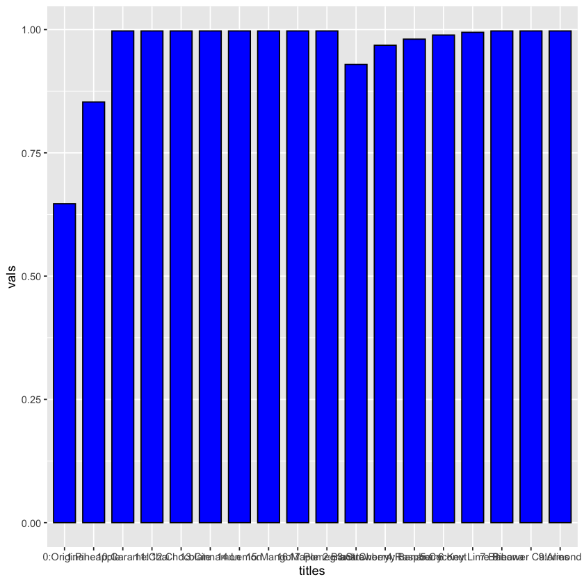
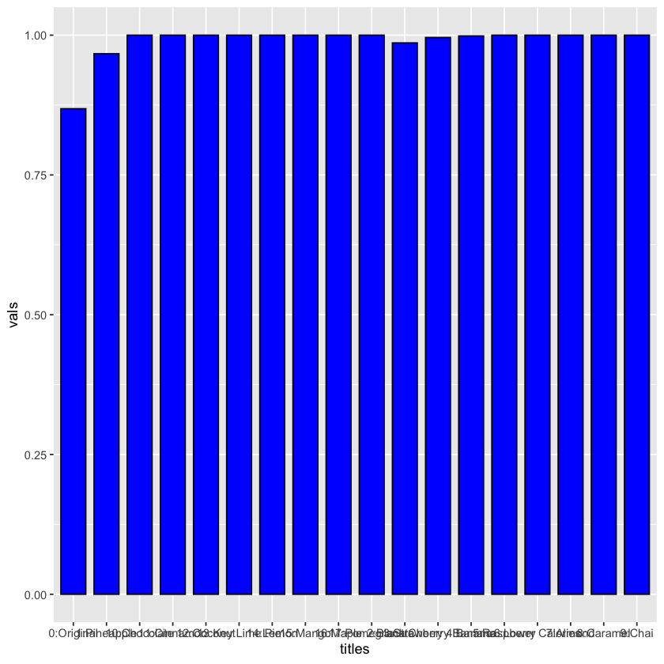

# Analytics Design to Recommend Flavors to Launch

Ya Liu

ya.liu1@simon.rochester.edu

https://github.com/yaliu0703

https://www.linkedin.com/in/yaliu1/


In this project, I am conducting analytics to provide recommendations to the decision of which flavors to launch next. Assume for this analysis that the private label recently launched six flavors--Blueberry, Honey, Peach, Plain, Strawberry, and Vanilla. I focused on providing analytics to help determine what the next flavors to launch should be. The main methology I use is TURF analysis.

## 1. Prepare data

### 1.1 Extract data from datasets

Use MySQL to extract data from datasets.


```R

#show databases;

#use retailer1;

#show tables;

```

Firstly, let's extract sales data of existing flavors in the Greek yogurt category (all brands).


```R
#select Flavor1,sum(Sales)
#from storeItemSales,itemsAttributes
#where storeItemSales.`Item.Num`=itemsAttributes.`Item.Num` AND Class="GREEK" 
#group by Flavor1
#order by sum(Sales) desc;
```

Now, let's look at the percentage of sales of existing flavors in the regular yogurt category (all brands). 


```R
#select Flavor1,sum(Sales)
#from storeItemSales,itemsAttributes
#where storeItemSales.`Item.Num`=itemsAttributes.`Item.Num` AND Class="REGULAR" 
#group by Flavor1
#order by sum(Sales) desc;
library(foreign)
library(ggplot2)
```

### 1.2 Export sales data and load data

We export the result to csv files called 'Greek yogurt.csv' and 'Regular yogurt.csv', load them into R to conduct further analysis. 


```R
# load data and calculate the percentage of sales for both categories
greek_sumsales <- read.csv('Greek yogurt.csv')
greek_sumsales$Precentage <- greek_sumsales$sum.Sales. / sum(greek_sumsales$sum.Sales.)
reg_sumsales <- read.csv('Regular yogurt.csv')
reg_sumsales$Precentage <- reg_sumsales$sum.Sales. / sum(reg_sumsales$sum.Sales.)
head(greek_sumsales)
head(reg_sumsales)


```


<table>
<caption>A data.frame: 6 × 3</caption>
<thead>
	<tr><th></th><th scope=col>Flavor1</th><th scope=col>sum.Sales.</th><th scope=col>Precentage</th></tr>
	<tr><th></th><th scope=col>&lt;fct&gt;</th><th scope=col>&lt;dbl&gt;</th><th scope=col>&lt;dbl&gt;</th></tr>
</thead>
<tbody>
	<tr><th scope=row>1</th><td>plain     </td><td>3972150.6</td><td>0.17085328</td></tr>
	<tr><th scope=row>2</th><td>cherry    </td><td> 681627.6</td><td>0.02931870</td></tr>
	<tr><th scope=row>3</th><td>honey     </td><td>1856677.4</td><td>0.07986087</td></tr>
	<tr><th scope=row>4</th><td>strawberry</td><td>3486000.1</td><td>0.14994259</td></tr>
	<tr><th scope=row>5</th><td>vanilla   </td><td>2402307.7</td><td>0.10332995</td></tr>
	<tr><th scope=row>6</th><td>blueberry </td><td>3125385.4</td><td>0.13443154</td></tr>
</tbody>
</table>


<table>
<caption>A data.frame: 6 × 3</caption>
<thead>
	<tr><th></th><th scope=col>Flavor1</th><th scope=col>sum.Sales.</th><th scope=col>Precentage</th></tr>
	<tr><th></th><th scope=col>&lt;fct&gt;</th><th scope=col>&lt;dbl&gt;</th><th scope=col>&lt;dbl&gt;</th></tr>
</thead>
<tbody>
	<tr><th scope=row>1</th><td>strawban  </td><td>2493551</td><td>0.03650684</td></tr>
	<tr><th scope=row>2</th><td>plain     </td><td>1042496</td><td>0.01526266</td></tr>
	<tr><th scope=row>3</th><td>strawberry</td><td>7719242</td><td>0.11301356</td></tr>
	<tr><th scope=row>4</th><td>blueberry </td><td>6256844</td><td>0.09160332</td></tr>
	<tr><th scope=row>5</th><td>peach     </td><td>5643022</td><td>0.08261666</td></tr>
	<tr><th scope=row>6</th><td>vanilla   </td><td>9066436</td><td>0.13273715</td></tr>
</tbody>
</table>


Now let's use market survey data. As there are some people who do not answer question 12, we delete those who answer none of them.


```R
surv <- read.csv('survResponses.csv')
surv_flavor <- surv[,c(15:37)] # keep onely flavor related questions 
surv_flavor <- surv_flavor[rowSums(is.na(surv_flavor)) != ncol(surv_flavor), ] # delete those who did not answer any option in Q12
```

### 1.3 Data processing

Change column names to flavors according to survey questions.


```R
flavor <- c('Lower Calories','Almond','Banana','Black Cherry','Blueberry','Caramel','Chai',
            'Chocolate','Cinnamon','Coconut','Honey','Key Lime Pie','Lemon','Mango',
            'Maple','Peach','Pineapple','Plain','Pomegranate','Raspberry','Strawberry',
            'Strawberry Banana','Vanilla')
```

Dupliecate the data frame in order not to change raw data


```R
sury_fla_name <- surv_flavor 
colnames(sury_fla_name) <- flavor
summary(sury_fla_name) # check number of NA and median for each flavor 
# median = 0(half of the respondant will buy regularly)--> Black Cherry,Pomegranate,Raspberry
```


     Lower Calories      Almond          Banana        Black Cherry   
     Min.   :0.000   Min.   :0.000   Min.   :0.0000   Min.   :0.0000  
     1st Qu.:1.000   1st Qu.:1.000   1st Qu.:0.0000   1st Qu.:0.0000  
     Median :1.000   Median :1.000   Median :1.0000   Median :0.0000  
     Mean   :1.181   Mean   :1.304   Mean   :0.7331   Mean   :0.5119  
     3rd Qu.:2.000   3rd Qu.:2.000   3rd Qu.:1.0000   3rd Qu.:1.0000  
     Max.   :2.000   Max.   :2.000   Max.   :2.0000   Max.   :2.0000  
     NA's   :98      NA's   :97      NA's   :55       NA's   :50      
       Blueberry        Caramel          Chai         Chocolate        Cinnamon    
     Min.   :0.000   Min.   :0.00   Min.   :0.000   Min.   :0.000   Min.   :0.000  
     1st Qu.:1.000   1st Qu.:1.00   1st Qu.:1.000   1st Qu.:1.000   1st Qu.:1.000  
     Median :2.000   Median :2.00   Median :1.000   Median :2.000   Median :1.000  
     Mean   :1.365   Mean   :1.64   Mean   :1.371   Mean   :1.451   Mean   :1.299  
     3rd Qu.:2.000   3rd Qu.:2.00   3rd Qu.:2.000   3rd Qu.:2.000   3rd Qu.:2.000  
     Max.   :2.000   Max.   :2.00   Max.   :2.000   Max.   :2.000   Max.   :2.000  
     NA's   :106     NA's   :103    NA's   :104     NA's   :101     NA's   :93     
        Coconut          Honey        Key Lime Pie        Lemon       
     Min.   :0.000   Min.   :0.000   Min.   :0.0000   Min.   :0.0000  
     1st Qu.:0.000   1st Qu.:1.000   1st Qu.:0.0000   1st Qu.:0.0000  
     Median :1.000   Median :1.000   Median :1.0000   Median :1.0000  
     Mean   :1.095   Mean   :1.197   Mean   :0.9984   Mean   :0.9211  
     3rd Qu.:2.000   3rd Qu.:2.000   3rd Qu.:2.0000   3rd Qu.:2.0000  
     Max.   :2.000   Max.   :2.000   Max.   :2.0000   Max.   :2.0000  
     NA's   :99      NA's   :102     NA's   :97       NA's   :76      
         Mango           Maple            Peach         Pineapple     
     Min.   :0.000   Min.   :0.0000   Min.   :0.000   Min.   :0.0000  
     1st Qu.:1.000   1st Qu.:0.0000   1st Qu.:0.000   1st Qu.:0.0000  
     Median :2.000   Median :1.0000   Median :1.000   Median :1.0000  
     Mean   :1.586   Mean   :0.7527   Mean   :1.035   Mean   :0.8392  
     3rd Qu.:2.000   3rd Qu.:1.0000   3rd Qu.:2.000   3rd Qu.:2.0000  
     Max.   :2.000   Max.   :2.0000   Max.   :2.000   Max.   :2.0000  
     NA's   :111     NA's   :75       NA's   :95      NA's   :69      
         Plain         Pomegranate       Raspberry        Strawberry   
     Min.   :0.0000   Min.   :0.0000   Min.   :0.0000   Min.   :0.000  
     1st Qu.:0.0000   1st Qu.:0.0000   1st Qu.:0.0000   1st Qu.:0.000  
     Median :1.0000   Median :0.0000   Median :0.0000   Median :1.000  
     Mean   :0.9573   Mean   :0.6273   Mean   :0.5892   Mean   :1.154  
     3rd Qu.:2.0000   3rd Qu.:1.0000   3rd Qu.:1.0000   3rd Qu.:2.000  
     Max.   :2.0000   Max.   :2.0000   Max.   :2.0000   Max.   :2.000  
     NA's   :90       NA's   :78       NA's   :72       NA's   :92     
     Strawberry Banana    Vanilla     
     Min.   :0.0000    Min.   :0.000  
     1st Qu.:0.0000    1st Qu.:1.000  
     Median :1.0000    Median :1.000  
     Mean   :0.7002    Mean   :1.317  
     3rd Qu.:1.0000    3rd Qu.:2.000  
     Max.   :2.0000    Max.   :2.000  
     NA's   :75        NA's   :114    


Get frequency of each type of responses by flavors


```R
Regularly <- c()
Occasionally <- c()
Never <- c()
Not_Applicable <- c()
for (j in 1:23) {
  Regularly <- c(Regularly, sum(sury_fla_name[,j] == 0, na.rm = TRUE))
  Occasionally <- c(Occasionally, sum(sury_fla_name[,j] == 1, na.rm = TRUE))
  Never <- c(Never, sum(sury_fla_name[,j] == 2, na.rm = TRUE))
  Not_Applicable <- c(Not_Applicable, sum(is.na(sury_fla_name[,j])))
}    
```

As answers for question 12 are categorical variabls, we use median to observe the results. If the median excesses 1, that means over half of respondents would consume this flavor occasionaly or regularly.


```R
summary(sury_fla_name)[3,]  #get median
summary(sury_fla_name)[4,]  #get mean
```


<dl class=dl-horizontal>
	<dt>Lower Calories</dt>
		<dd><span style=white-space:pre-wrap>'Median :1.000  '</span></dd>
	<dt><span style=white-space:pre-wrap>    Almond</span></dt>
		<dd><span style=white-space:pre-wrap>'Median :1.000  '</span></dd>
	<dt><span style=white-space:pre-wrap>    Banana</span></dt>
		<dd><span style=white-space:pre-wrap>'Median :1.0000  '</span></dd>
	<dt> Black Cherry</dt>
		<dd><span style=white-space:pre-wrap>'Median :0.0000  '</span></dd>
	<dt><span style=white-space:pre-wrap>  Blueberry</span></dt>
		<dd><span style=white-space:pre-wrap>'Median :2.000  '</span></dd>
	<dt><span style=white-space:pre-wrap>   Caramel</span></dt>
		<dd><span style=white-space:pre-wrap>'Median :2.00  '</span></dd>
	<dt><span style=white-space:pre-wrap>     Chai</span></dt>
		<dd><span style=white-space:pre-wrap>'Median :1.000  '</span></dd>
	<dt><span style=white-space:pre-wrap>  Chocolate</span></dt>
		<dd><span style=white-space:pre-wrap>'Median :2.000  '</span></dd>
	<dt><span style=white-space:pre-wrap>   Cinnamon</span></dt>
		<dd><span style=white-space:pre-wrap>'Median :1.000  '</span></dd>
	<dt><span style=white-space:pre-wrap>   Coconut</span></dt>
		<dd><span style=white-space:pre-wrap>'Median :1.000  '</span></dd>
	<dt><span style=white-space:pre-wrap>    Honey</span></dt>
		<dd><span style=white-space:pre-wrap>'Median :1.000  '</span></dd>
	<dt> Key Lime Pie</dt>
		<dd><span style=white-space:pre-wrap>'Median :1.0000  '</span></dd>
	<dt><span style=white-space:pre-wrap>    Lemon</span></dt>
		<dd><span style=white-space:pre-wrap>'Median :1.0000  '</span></dd>
	<dt><span style=white-space:pre-wrap>    Mango</span></dt>
		<dd><span style=white-space:pre-wrap>'Median :2.000  '</span></dd>
	<dt><span style=white-space:pre-wrap>    Maple</span></dt>
		<dd><span style=white-space:pre-wrap>'Median :1.0000  '</span></dd>
	<dt><span style=white-space:pre-wrap>    Peach</span></dt>
		<dd><span style=white-space:pre-wrap>'Median :1.000  '</span></dd>
	<dt><span style=white-space:pre-wrap>  Pineapple</span></dt>
		<dd><span style=white-space:pre-wrap>'Median :1.0000  '</span></dd>
	<dt><span style=white-space:pre-wrap>    Plain</span></dt>
		<dd><span style=white-space:pre-wrap>'Median :1.0000  '</span></dd>
	<dt> Pomegranate</dt>
		<dd><span style=white-space:pre-wrap>'Median :0.0000  '</span></dd>
	<dt><span style=white-space:pre-wrap>  Raspberry</span></dt>
		<dd><span style=white-space:pre-wrap>'Median :0.0000  '</span></dd>
	<dt><span style=white-space:pre-wrap>  Strawberry</span></dt>
		<dd><span style=white-space:pre-wrap>'Median :1.000  '</span></dd>
	<dt>Strawberry Banana</dt>
		<dd><span style=white-space:pre-wrap>'Median :1.0000  '</span></dd>
	<dt><span style=white-space:pre-wrap>   Vanilla</span></dt>
		<dd><span style=white-space:pre-wrap>'Median :1.000  '</span></dd>
</dl>


<dl class=dl-horizontal>
	<dt>Lower Calories</dt>
		<dd><span style=white-space:pre-wrap>'Mean   :1.181  '</span></dd>
	<dt><span style=white-space:pre-wrap>    Almond</span></dt>
		<dd><span style=white-space:pre-wrap>'Mean   :1.304  '</span></dd>
	<dt><span style=white-space:pre-wrap>    Banana</span></dt>
		<dd><span style=white-space:pre-wrap>'Mean   :0.7331  '</span></dd>
	<dt> Black Cherry</dt>
		<dd><span style=white-space:pre-wrap>'Mean   :0.5119  '</span></dd>
	<dt><span style=white-space:pre-wrap>  Blueberry</span></dt>
		<dd><span style=white-space:pre-wrap>'Mean   :1.365  '</span></dd>
	<dt><span style=white-space:pre-wrap>   Caramel</span></dt>
		<dd><span style=white-space:pre-wrap>'Mean   :1.64  '</span></dd>
	<dt><span style=white-space:pre-wrap>     Chai</span></dt>
		<dd><span style=white-space:pre-wrap>'Mean   :1.371  '</span></dd>
	<dt><span style=white-space:pre-wrap>  Chocolate</span></dt>
		<dd><span style=white-space:pre-wrap>'Mean   :1.451  '</span></dd>
	<dt><span style=white-space:pre-wrap>   Cinnamon</span></dt>
		<dd><span style=white-space:pre-wrap>'Mean   :1.299  '</span></dd>
	<dt><span style=white-space:pre-wrap>   Coconut</span></dt>
		<dd><span style=white-space:pre-wrap>'Mean   :1.095  '</span></dd>
	<dt><span style=white-space:pre-wrap>    Honey</span></dt>
		<dd><span style=white-space:pre-wrap>'Mean   :1.197  '</span></dd>
	<dt> Key Lime Pie</dt>
		<dd><span style=white-space:pre-wrap>'Mean   :0.9984  '</span></dd>
	<dt><span style=white-space:pre-wrap>    Lemon</span></dt>
		<dd><span style=white-space:pre-wrap>'Mean   :0.9211  '</span></dd>
	<dt><span style=white-space:pre-wrap>    Mango</span></dt>
		<dd><span style=white-space:pre-wrap>'Mean   :1.586  '</span></dd>
	<dt><span style=white-space:pre-wrap>    Maple</span></dt>
		<dd><span style=white-space:pre-wrap>'Mean   :0.7527  '</span></dd>
	<dt><span style=white-space:pre-wrap>    Peach</span></dt>
		<dd><span style=white-space:pre-wrap>'Mean   :1.035  '</span></dd>
	<dt><span style=white-space:pre-wrap>  Pineapple</span></dt>
		<dd><span style=white-space:pre-wrap>'Mean   :0.8392  '</span></dd>
	<dt><span style=white-space:pre-wrap>    Plain</span></dt>
		<dd><span style=white-space:pre-wrap>'Mean   :0.9573  '</span></dd>
	<dt> Pomegranate</dt>
		<dd><span style=white-space:pre-wrap>'Mean   :0.6273  '</span></dd>
	<dt><span style=white-space:pre-wrap>  Raspberry</span></dt>
		<dd><span style=white-space:pre-wrap>'Mean   :0.5892  '</span></dd>
	<dt><span style=white-space:pre-wrap>  Strawberry</span></dt>
		<dd><span style=white-space:pre-wrap>'Mean   :1.154  '</span></dd>
	<dt>Strawberry Banana</dt>
		<dd><span style=white-space:pre-wrap>'Mean   :0.7002  '</span></dd>
	<dt><span style=white-space:pre-wrap>   Vanilla</span></dt>
		<dd><span style=white-space:pre-wrap>'Mean   :1.317  '</span></dd>
</dl>


```R
Median <- c(1,1,1,0,2,2,1,2,1,1,1,1,1,2,1,1,1,1,0,0,1,1,1)
Mean <- c(1.181,1.304,0.7331,0.5119,1.365,1.64,1.371,1.451,1.299,1.095,1.197,0.9984,
          0.9211,1.586,0.7527,1.035,0.8392,0.9573,0.6273,0.5892,1.154,0.7002,1.317)
```


```R
Q3 <- data.frame(flavor, Regularly, Occasionally, Never, Not_Applicable, Median, Mean)
write.csv(Q3, "Q3.csv")   #for tableau operations
```

## 2. Define Functions for TURF Anlytsis 
measReach: measures reach given set of options and data

  Arguments:
  
  data contains measure of proxy for whether will buy or not, positive values mean will buy/use
  
  Return:
  
  scalar, reach, calculated as % of all cases that will buy at least one in set


```R
measReach = function(data){
  if(is.null(dim(data))){ #if data is a vector
    ret = sum(data>0,na.rm=TRUE)/length(data)
  } else if(ncol(data)==1){ #if data has only one column
    ret = sum(data>0,na.rm=TRUE)/length(data)
  }
  else { #if data has multiple columns
    ret = sum(apply(data>0,1,any),na.rm=TRUE)/nrow(data)
  }
}
```


evalNext: evaluates the next set, nextSet using measure given existing set in data


Arguments:

  nextSet, set are numeric indexes into columns of data
  
  data contains measure of proxy for whether will buy or not, positive values mean will buy/use
  
  measure is a valid measure of evaluation when passed a subset of columns in data

Return:

numeric vector of values calculated using measure for each option in nextSet given set already exists


```R
evalNext = function(nextSet,set,data,measure=measReach){
  vals = numeric(length(nextSet)) #set up storage for return value
  for(k in 1:length(nextSet)){ #loop over the options in nextSet
    if(length(set)==0){         #if no existing options
      vals[k] = measure(data[,nextSet[k]]) 
    } else {                    #if existing options
      vals[k] = measure(data[,c(set,nextSet[k])])
    }
  }
  vals
}
```

evalFull: creates optimal full evaluation starting from origSet and considering remaining options fullSet


Arguments:

fullSet, origSet are numeric indexes into columns of data

data contains measure of proxy for whether will buy or not, positive values mean will buy/use

measure is a valid measure of evaluation when passed a subset of columns in data


Return:

turf object, an named list containing

ordSet, the ordered set of optimal options to add to original set

optVals, the optimal values of measure as you add each optimal option

origSet, same value as passed, the original set of options included

origVal, the value of measure for the original set

measure, same value as passed, the measure used

pnames, the names of the options taken from the columns of data


```R
evalFull = function(fullSet,data,origSet=numeric(0),measure=measReach){
  curSet = origSet; #the current set of included options
  remSet = fullSet[!(fullSet%in%origSet)]; #the remaining set of options to consider
  K = length(remSet)
  optVals = numeric(K); #create storage for the optimal values (optVals)
  ordSet = numeric(K); #create storage for ordered set
  for(i in 1:K){          #loop over the remaining set consider
    tmpVals = evalNext(remSet,curSet,data,measure); #calculate vector of next evaluations
    k = which.max(tmpVals) #pick the option that gives max measure, note will pick first case if a tie!
    optVals[i] = tmpVals[k] #add optimal value
    ordSet[i] = remSet[k]   #add index of option that creates optimal value
    curSet = c(curSet,ordSet[i]); #add optimal next option to current set
    remSet = remSet[-k];          #delete optimal next option from remaining set
  }
  #creaets a "TURF object" containing ordSet, optVals, origSet, origVal, measure, and pnames
  turf = list(ordSet=ordSet,optVals=optVals,origSet=origSet,origVal=measure(data[,origSet]),measure=measure,pnames=colnames(data))
  class(turf)="TURF" #makes the list into a TURF object so that can call plot.TURF
  turf  #return turf
}
```

create ggplot barplot for a turf object


```R
plot.TURF=function(turf,...){
  if(class(turf)!="TURF"){
    cat("Object not a turf.")
  } else {
    df = with(turf,data.frame(vals = c(origVal,optVals),titles=paste(0:length(ordSet),c("Original",pnames[ordSet]),sep=":")))
    #with(turf,barplot(c(origVal,optVals),names.arg=c("Original",pnames[ordSet])))
    dodge = position_dodge(width=.75); ##to form constant dimensions positioning for all geom's
    gp = ggplot(df,aes(y=vals,x=titles))
    gp + geom_bar(position=dodge,stat="identity",col=1,fill=4,width=.75)
  }
}
```


```R
turf = evalFull(c(1:23),reg_data,c(5,11,16,18,21,23))
plot(turf)
```





if we only want to target customers who regularly consume a certain flavor


```R
reg_data <- sury_fla_name
# encode: 0 - Never+Occasionally, 1 - Regular
for (i in 1:23) {
    reg_data[,i][reg_data[,i]==1]<-2
    reg_data[,i][reg_data[,i]==0]<-1
    reg_data[,i][reg_data[,i]==2]<-0
}
summary(reg_data) # check the results 
turf = evalFull(c(1:23),reg_data,c(5,11,16,18,21,23))
plot(turf)
turf
```


     Lower Calories       Almond          Banana        Black Cherry   
     Min.   :0.0000   Min.   :0.000   Min.   :0.0000   Min.   :0.0000  
     1st Qu.:0.0000   1st Qu.:0.000   1st Qu.:0.0000   1st Qu.:0.0000  
     Median :0.0000   Median :0.000   Median :0.0000   Median :1.0000  
     Mean   :0.2292   Mean   :0.176   Mean   :0.4798   Mean   :0.5893  
     3rd Qu.:0.0000   3rd Qu.:0.000   3rd Qu.:1.0000   3rd Qu.:1.0000  
     Max.   :1.0000   Max.   :1.000   Max.   :1.0000   Max.   :1.0000  
     NA's   :98       NA's   :97      NA's   :55       NA's   :50      
       Blueberry        Caramel             Chai          Chocolate     
     Min.   :0.000   Min.   :0.00000   Min.   :0.0000   Min.   :0.0000  
     1st Qu.:0.000   1st Qu.:0.00000   1st Qu.:0.0000   1st Qu.:0.0000  
     Median :0.000   Median :0.00000   Median :0.0000   Median :0.0000  
     Mean   :0.138   Mean   :0.06785   Mean   :0.1278   Mean   :0.1127  
     3rd Qu.:0.000   3rd Qu.:0.00000   3rd Qu.:0.0000   3rd Qu.:0.0000  
     Max.   :1.000   Max.   :1.00000   Max.   :1.0000   Max.   :1.0000  
     NA's   :106     NA's   :103       NA's   :104      NA's   :101     
        Cinnamon        Coconut           Honey         Key Lime Pie   
     Min.   :0.000   Min.   :0.0000   Min.   :0.0000   Min.   :0.0000  
     1st Qu.:0.000   1st Qu.:0.0000   1st Qu.:0.0000   1st Qu.:0.0000  
     Median :0.000   Median :0.0000   Median :0.0000   Median :0.0000  
     Mean   :0.194   Mean   :0.2761   Mean   :0.1952   Mean   :0.3024  
     3rd Qu.:0.000   3rd Qu.:1.0000   3rd Qu.:0.0000   3rd Qu.:1.0000  
     Max.   :1.000   Max.   :1.0000   Max.   :1.0000   Max.   :1.0000  
     NA's   :93      NA's   :99       NA's   :102      NA's   :97      
         Lemon           Mango             Maple            Peach       
     Min.   :0.000   Min.   :0.00000   Min.   :0.0000   Min.   :0.0000  
     1st Qu.:0.000   1st Qu.:0.00000   1st Qu.:0.0000   1st Qu.:0.0000  
     Median :0.000   Median :0.00000   Median :0.0000   Median :0.0000  
     Mean   :0.356   Mean   :0.07856   Mean   :0.4529   Mean   :0.3206  
     3rd Qu.:1.000   3rd Qu.:0.00000   3rd Qu.:1.0000   3rd Qu.:1.0000  
     Max.   :1.000   Max.   :1.00000   Max.   :1.0000   Max.   :1.0000  
     NA's   :76      NA's   :111       NA's   :75       NA's   :95      
       Pineapple          Plain         Pomegranate       Raspberry     
     Min.   :0.0000   Min.   :0.0000   Min.   :0.0000   Min.   :0.0000  
     1st Qu.:0.0000   1st Qu.:0.0000   1st Qu.:0.0000   1st Qu.:0.0000  
     Median :0.0000   Median :0.0000   Median :1.0000   Median :1.0000  
     Mean   :0.4135   Mean   :0.3465   Mean   :0.5233   Mean   :0.5415  
     3rd Qu.:1.0000   3rd Qu.:1.0000   3rd Qu.:1.0000   3rd Qu.:1.0000  
     Max.   :1.0000   Max.   :1.0000   Max.   :1.0000   Max.   :1.0000  
     NA's   :69       NA's   :90       NA's   :78       NA's   :72      
       Strawberry     Strawberry Banana    Vanilla     
     Min.   :0.0000   Min.   :0.0000    Min.   :0.000  
     1st Qu.:0.0000   1st Qu.:0.0000    1st Qu.:0.000  
     Median :0.0000   Median :0.0000    Median :0.000  
     Mean   :0.2524   Mean   :0.4467    Mean   :0.176  
     3rd Qu.:1.0000   3rd Qu.:1.0000    3rd Qu.:0.000  
     Max.   :1.0000   Max.   :1.0000    Max.   :1.000  
     NA's   :92       NA's   :75        NA's   :114    


    $ordSet
     [1] 17  4 22 20 10 12  3  1  2  6  7  8  9 13 14 15 19
    
    $optVals
     [1] 0.8531856 0.9293629 0.9681440 0.9806094 0.9889197 0.9944598 0.9972299
     [8] 0.9972299 0.9972299 0.9972299 0.9972299 0.9972299 0.9972299 0.9972299
    [15] 0.9972299 0.9972299 0.9972299
    
    $origSet
    [1]  5 11 16 18 21 23
    
    $origVal
    [1] 0.6468144
    
    $measure
    function(data){
      if(is.null(dim(data))){ #if data is a vector
        ret = sum(data>0,na.rm=TRUE)/length(data)
      } else if(ncol(data)==1){ #if data has only one column
        ret = sum(data>0,na.rm=TRUE)/length(data)
      }
      else { #if data has multiple columns
        ret = sum(apply(data>0,1,any),na.rm=TRUE)/nrow(data)
      }
    }
    <bytecode: 0x7fc6c402db60>
    
    $pnames
     [1] "Lower Calories"    "Almond"            "Banana"           
     [4] "Black Cherry"      "Blueberry"         "Caramel"          
     [7] "Chai"              "Chocolate"         "Cinnamon"         
    [10] "Coconut"           "Honey"             "Key Lime Pie"     
    [13] "Lemon"             "Mango"             "Maple"            
    [16] "Peach"             "Pineapple"         "Plain"            
    [19] "Pomegranate"       "Raspberry"         "Strawberry"       
    [22] "Strawberry Banana" "Vanilla"          
    
    attr(,"class")
    [1] "TURF"


```R
reg.oca_data <- sury_fla_name
# encode: 0 - Never, 1 - Regular+Occasionally
for (i in 1:23) {
    reg.oca_data[,i][reg.oca_data[,i]==0]<-1
    reg.oca_data[,i][reg.oca_data[,i]==2]<-0
}
summary(reg.oca_data) # check the results 
turf2 = evalFull(c(1:23),reg.oca_data,c(5,11,16,18,21,23))
plot(turf2)
turf2
```


     Lower Calories       Almond         Banana        Black Cherry   
     Min.   :0.0000   Min.   :0.00   Min.   :0.0000   Min.   :0.0000  
     1st Qu.:0.0000   1st Qu.:0.00   1st Qu.:1.0000   1st Qu.:1.0000  
     Median :1.0000   Median :1.00   Median :1.0000   Median :1.0000  
     Mean   :0.5897   Mean   :0.52   Mean   :0.7871   Mean   :0.8988  
     3rd Qu.:1.0000   3rd Qu.:1.00   3rd Qu.:1.0000   3rd Qu.:1.0000  
     Max.   :1.0000   Max.   :1.00   Max.   :1.0000   Max.   :1.0000  
     NA's   :98       NA's   :97     NA's   :55       NA's   :50      
       Blueberry         Caramel            Chai          Chocolate     
     Min.   :0.0000   Min.   :0.0000   Min.   :0.0000   Min.   :0.0000  
     1st Qu.:0.0000   1st Qu.:0.0000   1st Qu.:0.0000   1st Qu.:0.0000  
     Median :0.0000   Median :0.0000   Median :1.0000   Median :0.0000  
     Mean   :0.4968   Mean   :0.2924   Mean   :0.5016   Mean   :0.4364  
     3rd Qu.:1.0000   3rd Qu.:1.0000   3rd Qu.:1.0000   3rd Qu.:1.0000  
     Max.   :1.0000   Max.   :1.0000   Max.   :1.0000   Max.   :1.0000  
     NA's   :106      NA's   :103      NA's   :104      NA's   :101     
        Cinnamon         Coconut           Honey         Key Lime Pie   
     Min.   :0.0000   Min.   :0.0000   Min.   :0.0000   Min.   :0.0000  
     1st Qu.:0.0000   1st Qu.:0.0000   1st Qu.:0.0000   1st Qu.:0.0000  
     Median :1.0000   Median :1.0000   Median :1.0000   Median :1.0000  
     Mean   :0.5071   Mean   :0.6292   Mean   :0.6081   Mean   :0.6992  
     3rd Qu.:1.0000   3rd Qu.:1.0000   3rd Qu.:1.0000   3rd Qu.:1.0000  
     Max.   :1.0000   Max.   :1.0000   Max.   :1.0000   Max.   :1.0000  
     NA's   :93       NA's   :99       NA's   :102      NA's   :97      
         Lemon            Mango            Maple            Peach       
     Min.   :0.0000   Min.   :0.0000   Min.   :0.0000   Min.   :0.0000  
     1st Qu.:0.0000   1st Qu.:0.0000   1st Qu.:1.0000   1st Qu.:0.0000  
     Median :1.0000   Median :0.0000   Median :1.0000   Median :1.0000  
     Mean   :0.7229   Mean   :0.3355   Mean   :0.7944   Mean   :0.6443  
     3rd Qu.:1.0000   3rd Qu.:1.0000   3rd Qu.:1.0000   3rd Qu.:1.0000  
     Max.   :1.0000   Max.   :1.0000   Max.   :1.0000   Max.   :1.0000  
     NA's   :76       NA's   :111      NA's   :75       NA's   :95      
       Pineapple          Plain         Pomegranate       Raspberry     
     Min.   :0.0000   Min.   :0.0000   Min.   :0.0000   Min.   :0.0000  
     1st Qu.:0.0000   1st Qu.:0.0000   1st Qu.:1.0000   1st Qu.:1.0000  
     Median :1.0000   Median :1.0000   Median :1.0000   Median :1.0000  
     Mean   :0.7473   Mean   :0.6962   Mean   :0.8494   Mean   :0.8692  
     3rd Qu.:1.0000   3rd Qu.:1.0000   3rd Qu.:1.0000   3rd Qu.:1.0000  
     Max.   :1.0000   Max.   :1.0000   Max.   :1.0000   Max.   :1.0000  
     NA's   :69       NA's   :90       NA's   :78       NA's   :72      
       Strawberry     Strawberry Banana    Vanilla      
     Min.   :0.0000   Min.   :0.0000    Min.   :0.0000  
     1st Qu.:0.0000   1st Qu.:1.0000    1st Qu.:0.0000  
     Median :1.0000   Median :1.0000    Median :1.0000  
     Mean   :0.5937   Mean   :0.8532    Mean   :0.5066  
     3rd Qu.:1.0000   3rd Qu.:1.0000    3rd Qu.:1.0000  
     Max.   :1.0000   Max.   :1.0000    Max.   :1.0000  
     NA's   :92       NA's   :75        NA's   :114     


    $ordSet
     [1] 17  4 22  3 20  1  2  6  7  8  9 10 12 13 14 15 19
    
    $optVals
     [1] 0.9667590 0.9861496 0.9958449 0.9986150 1.0000000 1.0000000 1.0000000
     [8] 1.0000000 1.0000000 1.0000000 1.0000000 1.0000000 1.0000000 1.0000000
    [15] 1.0000000 1.0000000 1.0000000
    
    $origSet
    [1]  5 11 16 18 21 23
    
    $origVal
    [1] 0.8684211
    
    $measure
    function(data){
      if(is.null(dim(data))){ #if data is a vector
        ret = sum(data>0,na.rm=TRUE)/length(data)
      } else if(ncol(data)==1){ #if data has only one column
        ret = sum(data>0,na.rm=TRUE)/length(data)
      }
      else { #if data has multiple columns
        ret = sum(apply(data>0,1,any),na.rm=TRUE)/nrow(data)
      }
    }
    <bytecode: 0x7fc6c402db60>
    
    $pnames
     [1] "Lower Calories"    "Almond"            "Banana"           
     [4] "Black Cherry"      "Blueberry"         "Caramel"          
     [7] "Chai"              "Chocolate"         "Cinnamon"         
    [10] "Coconut"           "Honey"             "Key Lime Pie"     
    [13] "Lemon"             "Mango"             "Maple"            
    [16] "Peach"             "Pineapple"         "Plain"            
    [19] "Pomegranate"       "Raspberry"         "Strawberry"       
    [22] "Strawberry Banana" "Vanilla"          
    
    attr(,"class")
    [1] "TURF"





## 3. Insights


